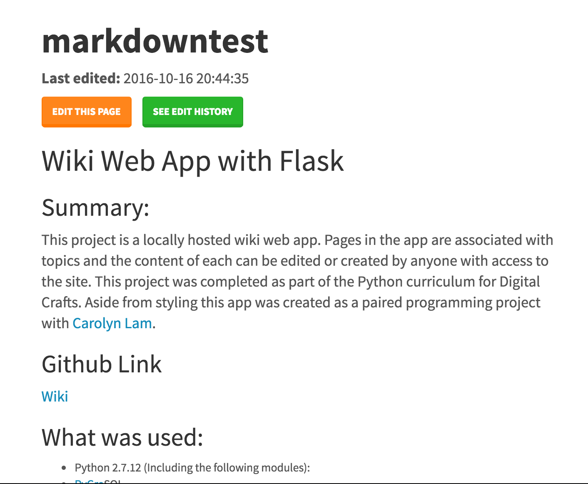

# Wiki Web App with Flask

##Summary:
This project is a locally hosted wiki web app.  Pages in the app are associated with topics and the content of each can be edited or created by anyone with access to the site.
This project was completed as part of the Python curriculum for Digital Crafts.
Aside from styling this app was created as a paired programming project with [Carolyn Lam](https://github.com/Pumala).

##Github Link
[Wiki](https://github.com/jesslynlandgren/wiki)

##What was used:
* Python 2.7.12 (Including the following modules):
  - PyGreSQL
* Flask/Jinja
* PostGreSQL locally hosted database
* HTML/CSS
* Bootstrap
  - (Bootswatch Lumen theme)

##Requirements:
(Cannot be run - database is currently hosted locally)
* Python 2 or Python 3
* Flask/Jinja

##Goals:

* Each page should extend a base HTML template.  
* The app should support the following separate pages:
- List of all wiki pages
- Display of page content
- Edit page content
* A user should be able to view a chronological history of page edits
* CamelCase words typed by the user in the content editor should automatically become hyperlinks to a wiki page of the same name
* Content entered using Markdown language should be rendered appropriately
* User should be able to search for a specific page
* Entering a page name directly in the URL bar of the browser should automatically navigate to the wiki page of that name or create one if one does not already exist.

##Code Snippets
All pages were built off of a "homepage.html" template.  The layout template contains the necessary header, styling, and top bar elements such as the search function, an option to return home (see all pages), and to create a new page.  The remaining pages overwrite a div element in the body of that template.

```html
<!DOCTYPE html>





<table class="table table-striped">
  <h1>Edit History for <span class="text-success">{{pagename}}</span></h1>
  <thead>
    <tr>
      <th>Time Stamp</th>
    </tr>
  </thead>
  <tbody>
    
    <tr>
      <td>
        <a href="/{{h.pagename}}/hist/record?id={{h.content_id}}">{{h.timestamp}}</a>
      </td>
      
      <td>
        Page Created
      </td>
      
      
    </tr>
    
  </tbody>
</table>


```

```Python
app.route('/<page_name>')
def render_placeholder(page_name):
    query = db.query("select pages.id, pages.pagename, content.content, content.timestamp as ts from pages,content where content.pageid = pages.id and pages.pagename = '%s' order by content.timestamp desc limit 1" % page_name)
    results = query.namedresult()
    # print "Query: %r" % query
    is_available = False
    # print "Length: %d" % len(query.namedresult())
    if len(results) < 1:
        is_available = True
        db.insert(
            'pages', {
                'pagename': page_name
            }
        )
        newid = db.query("select * from pages where pages.pagename = '%s'" %page_name).namedresult()[0].id
        db.insert(
            'content', {
                'pageid': newid,
                'content': "Page Created",
                'timestamp': time.strftime('%Y-%m-%d %H:%M:%S', time.localtime())
            }
        )

        wiki_page = db.query("select pages.id, pages.pagename, content.pageid, content.content, content.timestamp as ts from pages, content where pages.id = content.pageid and pages.pagename = '%s'" % page_name).namedresult()[0]
    else:
        wiki_page = results[0]
    # if page_name in db.('wiki',)
    # db.insert('wiki', pagename=page_name,content="")
    timestamp = wiki_page.ts
    content = markdown.markdown(wiki_linkify(wiki_page.content))
    return render_template(
        'placeholder.html',
        page_name = page_name,
        is_available = is_available,
        wiki_linkify = wiki_linkify,
        content = content,
        markdown = markdown,
        wiki_page = wiki_page,
        timestamp = timestamp
    )
```


##Screenshots



